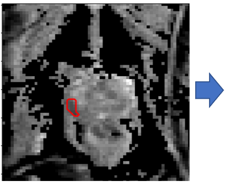
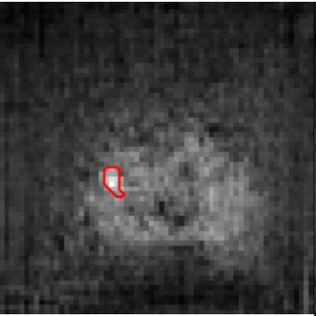

# Harnessing Uncertainty in Domain Adaptation for MRI Prostate Lesion Segmentation
 

This is the implementation (in PyTorch) of the following paper \
[Harnessing Uncertainty in Domain Adaptation for MRI Prostate Lesion Segmentation](https://arxiv.org/abs/2010.07411) \
Eleni Chiou, Francesco Giganti, Shonit Punwani, Iasonas Kokkinos, Eleftheria Panagiotaki \
International Conference on Medical Image Computing and Computer Assisted Intervention (MICCAI), 2020.

If you find this code useful for your research, please cite our paper:

```
@inproceedings{chiou20DA,
  title={Harnessing Uncertainty in Domain Adaptation for MRI Prostate Lesion Segmentation},
  author={Chiou, Eleni and Giganti, Francesco and Punwani, Shonit and Kokkinos, Iasonas and Panagiotaki, Eleftheria},
  booktitle={MICCAI},
  year={2020}
}
```

### Abstract
The need for training data can impede the adoption of novel imaging modalities for learning-based medical image analysis. Domain adaptation methods partially mitigate this problem by translating training data from a related source domain to a novel target domain, but typically assume that a one-to-one translation is possible. Our work addresses the challenge of adapting to a more informative target domain where multiple target samples can emerge from a single source sample. In particular we consider translating from mp-MRI to VERDICT, a richer MRI modality involving an optimized acquisition protocol for cancer characterization. We explicitly account for the inherent uncertainty of this mapping and exploit it to generate multiple outputs conditioned on a single input. Our results show that this allows us to extract systematically better image representations for the target domain, when used in tandem with both simple, CycleGAN-based baselines, as well as more powerful approaches that integrate discriminative segmentation losses and/or residual adapters. When compared to its deterministic counterparts, our approach yields substantial improvements across a broad range of dataset sizes, increasingly strong baselines, and evaluation measures.

### Installation / Setup:

This code was tested with Python 3.6, PyTorch 0.4.1, and CUDA 8.0/9.0.

1. Install PyTorch.
    ```
    conda install pytorch=0.4.1 torchvision cuda90 -c pytorch
    ```

2. Install additional dependencies.
    ```
    pip install -r requirements.txt
    ```

3. Clone the repo.
    ```
   git clone https://github.com/elchiou/DA.git
   ```

### Training
1. Download the dataset you want to use. The dataset directory should have the following structure.
   ```
   <data_root>/datasets/trainA/data                  % images
   <data_root>/datasets/trainA/seg_masks/            % segmentation masks
   <data_root>/datasets/trainB/data                  % images
   <data_root>/datasets/trainB/seg_masks/            % segmentation masks
   ...
   ```
2. Setup the configs/config.yaml file.

3. Train the model.
   ```
    ./scripts/train.sh
    ```
4. Intermediate image outputs and models are stored in results.

### Acknowledgements
MUNIT implementation is borrowed from [here](https://github.com/NVlabs/MUNIT).


